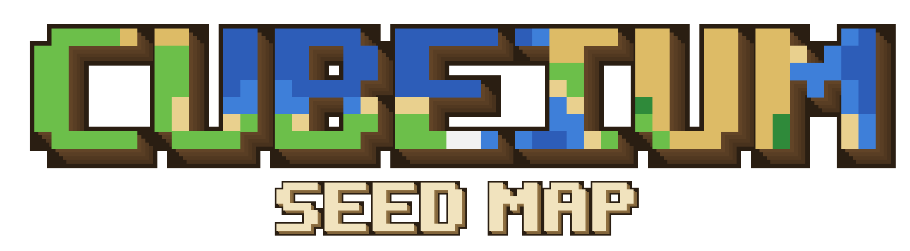

<p align="center"></p>

# Cubeium

An in-game seed map for Minecraft (Fabric): explore a seed's biomes and structures without leaving
the game. World generation is computed by [cubiomes](https://github.com/xpple/cubiomes) (the actively
maintained xpple fork) through its Java bindings.

Targets **Minecraft 26.3** (Java 25, Fabric Loader 0.19.5+, Fabric API).

## Using it

Press **M** in game to open the map. In singleplayer the world's seed is filled in automatically;
elsewhere, type it in (text seeds work exactly like on the Create World screen). Each world
remembers its own seed.

- Drag to pan, scroll or use **+ / -** to zoom, arrow keys to move, **Ctrl+1-4** to switch tabs.
  The arrow button next to the tabs hides the panel so the map can use the full height.
- Hover for the biome and coordinates, or a marker for its structure. Right-click for a menu:
  copy coordinates, center here, add or remove a waypoint, and teleport (when enabled and permitted).
- Switch between Overworld, Nether and End with the dimension button. The view keeps its place
  (Nether coordinates are 1/8 of the Overworld's), and on the linked map your position is shown
  faded where a portal would take you. The End has no such link.
- **Map** tab: region grid, coordinate axes, slime chunks, go to coordinates.
- **Structures** tab: every structure cubiomes supports for the dimension, shown with vanilla item
  icons, including End Cities with ships and the outer End gateways. Very common ones (ruined
  portals, shipwrecks, ocean ruins, trial chambers, mineshafts, buried treasure) start switched off.
  Structures that would crowd the map appear once you zoom in; the map says which ones.
- **Biomes** tab: search and highlight biomes by category; everything else is dimmed.
- **Waypoints** tab: rename, go to or delete the world's waypoints.
- **Settings** (gear): dark mode (blackstone background), floating tooltip, marker labels, teleport in menu, keep map
  position, render metrics, and the map screens' UI scale (Auto adapts to your window).

## Accuracy

`./gradlew runClientGameTest` starts the real 26.3 client and compares Cubeium with Minecraft's
own world generation for a test world:

- Biomes: identical at the map's sampling height in all three dimensions (20,000 samples).
  cubiomes has rare edge cases for underground cave biomes, which the map does not show.
- Strongholds: all 128 match. Slime chunks: identical for 40,000 chunks.
- Structures: per structure, every generation attempt near spawn is checked against Minecraft's
  placement and structure-start rules. Biome-only structures match exactly; those that also
  depend on terrain height (villages, pyramids, jungle temples, trail ruins, abandoned camps,
  mansions) agree for 97-99.6% of attempts because cubiomes can only estimate terrain.
- End City ships: checked against cities generated by the server; cubiomes' layout differs for
  about 1 in 25 cities.
- End gateways: every predicted gateway checked was generated by the server, and none appeared
  where none was predicted.

Known limitation: worlds using the Large Biomes preset are not supported yet.

## Building

```sh
./gradlew build
```

The jar ends up in `build/libs/`. The cubiomes bindings (with native libraries for Windows x64,
Linux x64 and macOS x64/arm64) are bundled inside it; no C toolchain is needed. The bindings
version in `gradle.properties` pins the cubiomes commit after the `+`.

### Tests

- `./gradlew test`: world generation (biome ground truth from real worlds, strongholds,
  structures, thread safety) and map view math.
- `./gradlew runClientGameTest`: the in-game comparison above, plus screenshots of every screen
  in `build/run/clientGameTest/screenshots/`.

## License

MIT (see `LICENSE`). cubiomes is MIT licensed as well; its license ships inside the bundled
bindings jar.
